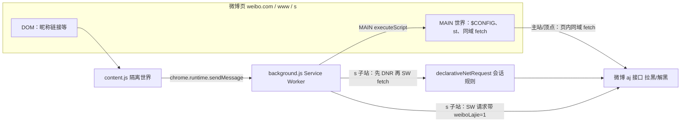

# 微博列表拉黑

在首页/热门/分组/搜索、实时/热门/视频 s 流等微博列表场景下，在发帖人昵称后提供「拉黑 / 已拉黑」快捷操作（详见 `manifest.json` 描述）。

---

## 功能说明

| 能力 | 说明 | 主要位置 |
|------|------|----------|
| **拉黑 / 解黑** | 调微博 `aj` 接口，在列表里对 uid 屏蔽；状态缓存在 `chrome.storage.local` | `content.js` + `background.js` |
| **灰标 / 推广卡隐藏** | **未去掉**，仍在 `content.js` 中。在**目标流**里扫描「推荐 / 荐读 / 广告」等灰标（含与时间在同一行时的短前缀、以及特定 `d.sinaimg.cn/prd/.../icon_auth_white` 小图），对命中的**整条微博卡片**做 `display: none`（`data-weibo-lajie-promo-blocked` 标记），与「是否拉黑该 uid」无直接关系 | `hidePromoFeedItems` 等 |

说明：第二项是**流内营销/广告样式**的整卡隐藏，**不是**浏览器级广告拦截或屏蔽所有第三方资源；若微博改版灰标结构，需改选择器/关键词。

---

## 技术栈

| 项 | 说明 |
|----|------|
| **平台** | Chrome 扩展，**Manifest V3**（MV3） |
| **语言** | 纯 **JavaScript**（无 TypeScript / 前端框架） |
| **后台** | **Service Worker**（`background.js`，事件驱动、无持久化页面） |
| **页面内** | **内容脚本**（`content.js`，在指定微博域名下注入，与页面 **JS 隔离**环境） |
| **页面主世界** | 通过 `chrome.scripting.executeScript` 的 `world: 'MAIN'`，在**微博页面自身运行的 JS 环境**里读取 `st`、或发起同域 `fetch` |
| **存储** | `chrome.storage.local` 记录本地「已拉黑 uid 集合」 |
| **网络与请求头** | `host_permissions` + `scripting`；`declarativeNetRequest` + `declarativeNetRequestWithHostAccess` 在 **s 子站**时，为发往 `www.weibo.com` 的请求补充 **Referer / Origin**（扩展内 `fetch` 无法自行设置 `Referer`） |
| **样式** | 独立 `content.css`，仅作用于扩展注入的类名 |

无构建链、无 `package.json`，扩展目录内以本仓库若干文件为主即可加载。

---

## 架构与数据流

- **内容脚本**：判断目标页、定位每条微博的「作者昵称链」、插入按钮；点击后向后台发消息；结合 `storage` 与 `MutationObserver`；**另含灰标/推广整卡隐藏**（`hidePromoFeedItems`，与拉黑独立）。
- **后台**：按当前是 **主站/顶点** 还是 **`s.weibo.com`** 分支：前者在 **MAIN** 中拉取与站内一致的 `aj` 请求；后者先读 `st`，用 **DNR 补头** 后由 **Service Worker** 对 `https://www.weibo.com/...&weiboLajie=1` 发 `fetch`（`weiboLajie=1` 与规则中的 `urlFilter` 对齐，避免误改站内其它 XHR）。

---

## 文件说明

### `manifest.json`

- 扩展名称、版本、描述与 **Service Worker** 入口。
- **内容脚本**匹配范围（`https://www.weibo.com/*`、`https://weibo.com/*`、`https://s.weibo.com/*`）及 `run_at: document_idle`。
- 声明权限：`storage`、`scripting`、`declarativeNetRequest`、`declarativeNetRequestWithHostAccess` 及 **host_permissions**。

**作用：扩展的元数据、权限与注入范围总表。**

---

### `content.js`

- `isTargetPage` / 各 s 子路径等：决定**是否**在当页扫流、插按钮；部分页面（如 `mygroups?gid=...`）会排除。
- 从 `a[href]` 中 **提取 uid**（含 `/u/uid`、`//weibo.com/数字` 等形态）。
- 在每条流里找到**发帖人昵称**对应链接，在其后插入「拉黑 / 已拉黑」并绑定点击。
- 通过 **`chrome.runtime.sendMessage`** 调用后台；根据返回 `code` 与本地集合更新状态。
- **灰标/推广整卡隐藏**：`hidePromoFeedItems` 与 `PROMO_TAG_WORDS` 等（见上一节功能表），在 `scanOnce` 中随扫描执行。
- 使用 **storage、MutationObserver** 与上述逻辑配套。

**作用：所有「页面上可见、可交互」及灰标整卡隐藏的逻辑。**

---

### `background.js`（Service Worker）

- 监听消息，执行拉黑 / 解黑。
- **主站/顶点域**：`executeScript` 在 **MAIN** 中执行**自包含**的异步函数：读 `st`、对当前 **origin** 的 `.../aj/filter/block`、`.../aj/f/delblack` 发请求（`Referer` 等与站内行为一致）。
- **`s.weibo.com`**：先 **MAIN 读 `st`**，再 **注册 DNR 会话规则**（对带 `weiboLajie=1` 的 `www` URL 补头），在 **本 SW 中 `fetch`**，结束后 **移除规则**。

**作用：不操作 DOM，负责与微博服务器通信；s 子站场景下负责 DNR + 跨子域请求。**

---

### `content.css`

- 仅针对扩展类名：`.weibo-lajie-wrap`、`.weibo-lajie-btn` 及**未拉黑 / 已拉黑 / 处理中** 等状态，控制间距、颜色、hover，尽量不打乱微博原有版式。

**作用：仅美化扩展注入的按钮与包裹层。**

---

## 一句话

**`content.js` 在页面上找人、画按钮，并整卡隐藏带灰标「推荐/荐读/广告」等的流内推广卡；`background.js` 在后台调微博 `aj` 并在 s 站用 DNR 补请求头；`manifest.json` 管权限与注入；`content.css` 只负责扩展按钮样式。** 无独立后端，网络请求均发生在用户本机浏览器的标签页与扩展上下文中。

---

## 本地加载

1. 打开 Chrome，进入 `chrome://extensions/`。
2. 开启「开发者模式」。
3. 「加载已解压的扩展程序」，选择本目录 `weibo-block-extension`。
4. 更新代码后在该页点击扩展卡片的「重新加载」。

---

## 相关链接

- [Chrome 扩展（Manifest V3）概览](https://developer.chrome.com/docs/extensions/mv3/intro/)（若需查 API 以开发或排错，可从此处进入文档。）

---

## 作者注

其实这是一个完全由 AI 构建的插件，所有的代码包括这个 README 文档都是完全由 AI 编写的，我只负责提需求、测试、反馈 bug。项目的起因是我经常摸鱼刷 weibo，而 weibo 铺天盖地的推广让我烦不胜烦，于是产生了这个 idea，并通过 AI 一点一点实现了自己的想法，虽然还不完美，但已经解决了我很头疼的问题。如果你也有和我一样的困扰欢迎使用这个插件，也许他会帮到你。由于是 AI 编写的，我也不打算主张什么版权之类的，喜欢的话欢迎拿去，随便用，随便改，但如果引发了任何问题不要来怪我哈 O_<
